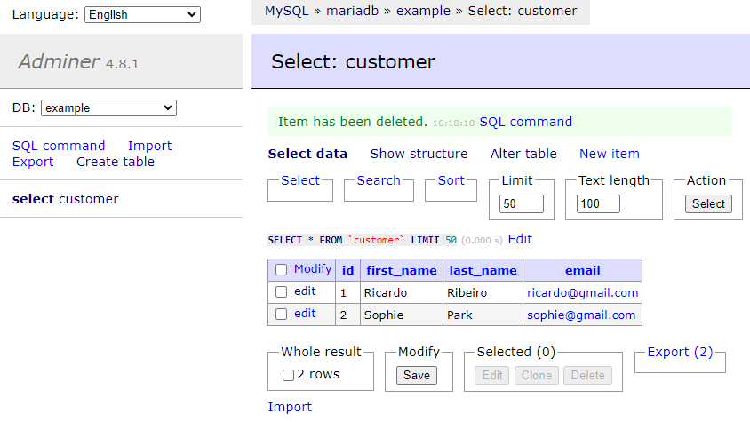

# Microservice V3

This project is an example of microservice using Spring Boot, Docker and Kafka.

# Running the application.

### 1. Create the MariaDB Docker Image

The folder `/scripts` has the scripts to create and populate the MariaDB database.

Run the commands below on the root project folder at the same order.

```shell
<microserviceV3>$ docker build -t mariadb-custon:latest .
<microserviceV3>$ docker tag mariadb-custon:latest ricardorqr/mariadb-custon
<microserviceV3>$ docker push ricardorqr/mariadb-custon
```

Here is how to check the database

- URL: http://localhost:8080/?server=mariadb
- Server: mariadb
- Username: root
- Password: example
- Database: example



### 2. Run application

1. Run docker

On the root project folder.

```shell
<microserviceV3>$ docker compose up
```

### 3. Links

- Customer MS Swagger: [http://localhost:8081/customers/swagger](http://localhost:8081/customers/swagger)